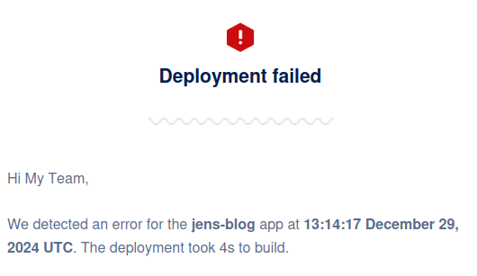
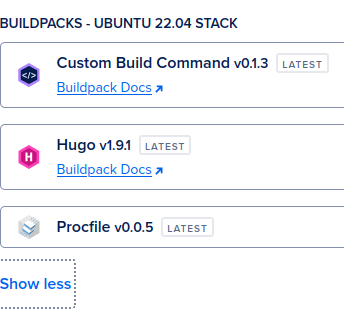
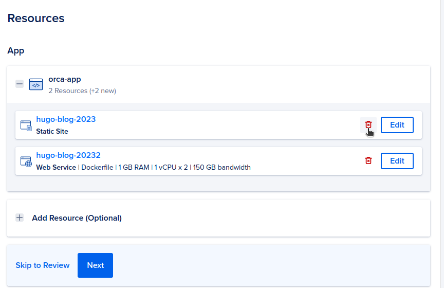
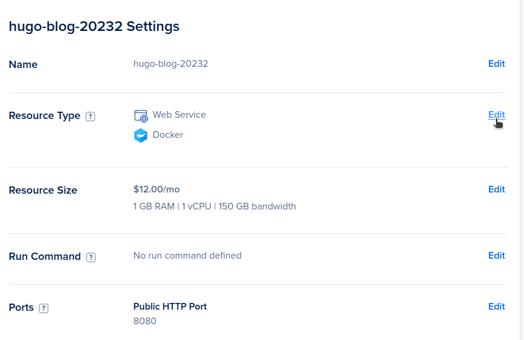
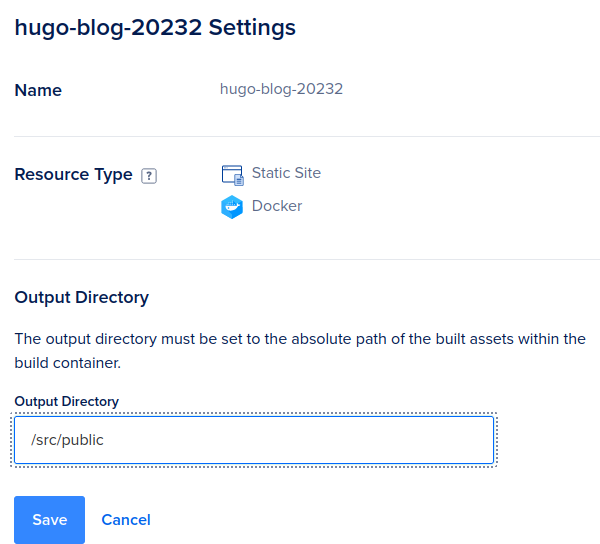
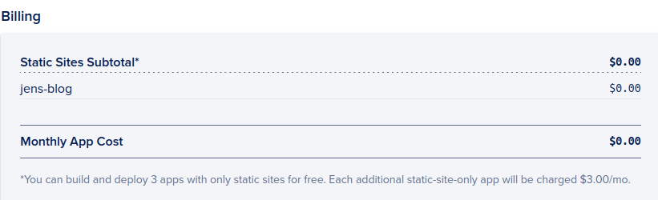

Once in a blue moon I check if older projects still work.
When updating this blog, I got greeted by this message: 

</img>

Damn you `My Team`, and the unwillingness to fix these errors.</br>
Either way: I'm putting some time aside to fix this while the daughters watch Frozen, so let's get to it. They're building a snowman already.

## Checking if there is a new build pack

Normally, updating the default build pack should fix this. So lets see if there is a new one:
</img>

Alrighty! Let's check the hugo version we are running.
The command `hugo version` yields `hugo v0.140.1-a9b0b95ef402a1cc70bc5386d649d947e2bcc027+extended`. 
There might be some confusion on the versioning, but 1.9.1 is **not** the version of hugo.</br>
It is the version of the build pack. This version uses `hugo v0.125.2` as last available version.

## The solution

Digitalocean apps get built in one of two ways:
1. Use a default build pack
2. Include a docker image that builds your site

After this issue with build packs, I know I will always include a dockerfile to get this built.

``` dockerfile
FROM hugomods/hugo:exts

COPY . /src
# Build commands: https://gohugo.io/commands/hugo_build/
RUN hugo build --minify 
```

We use the hugomods images, since these look pretty comprehensive.
There is nothing holding you back from using alpine and installing hugo yourself though. 
The `hugo:exts` image has a lot of extra's like postCSS also included, so this should cover most cases.
`docker build .` builds your site.

## Deploying the dockerfile

`git push` your changes to a repository. 
Since you can't change the deploy system for an app, we'll have to create a new one.

If the dockerfile was uploaded correctly, you should have the following resources:


This is going to sound weird, but we are going to delete the static site that will be auto-detected as hugo, and we are going to change the web service so that it becomes a static site.
The reason for this is that the existence of a dockerfile creates the default service.
In this case, we are going to use the dockerfile to build the static site, not to deploy a service. 



Change the resource type from service to static site.
Then, change the output directory to `/src/public`. 
The `public` part is where Hugo will build the site.
The `src` part is required since that is where we copy our files to in the dockerfile itself.



The HTTP request route can just be '/' as well, if it's only this blog in the digitalocean app.

There should be nothing else to set up.
The last important step here is to check the billing, which should be a cool 0.00 for a static site.


## More links

- [hugomods](https://blog.hugomods.com/posts/2024/01/deploy-hugo-static-sites-on-digitalocean-app-platform-via-docker/) has a more concise version of this post.
I just found out after writing this though, so I figured I'd just post this. 
- [This is a digitalocean referral link](https://m.do.co/c/b32e87be711c) if anyone wants to try.
Referrals give you (the clicker) $200 dollars in credits for 60 days. 
They provide me with $25 when someone actually buys in for a month.