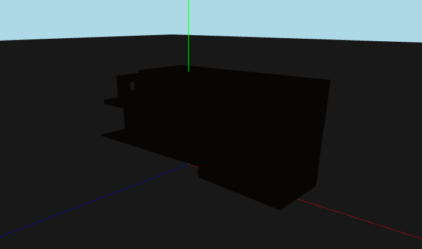
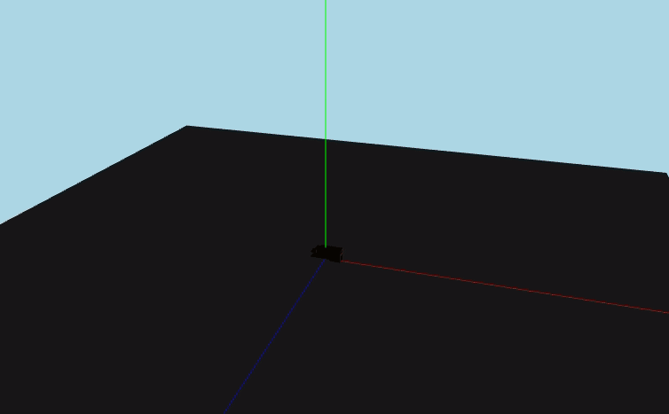
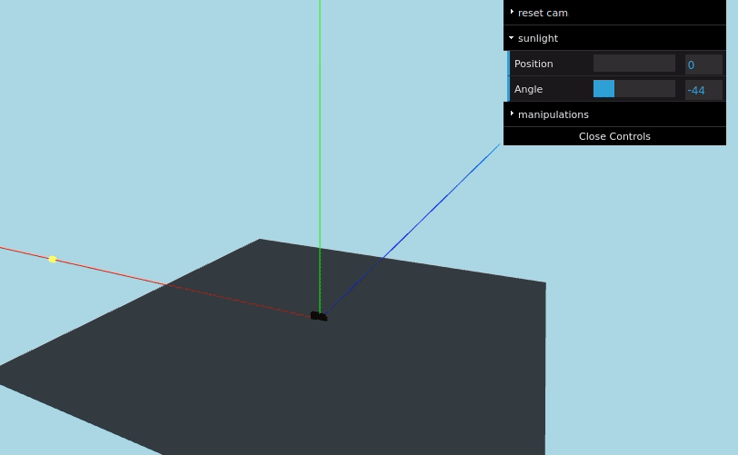

I've spent a small part of my last evenings on getting a sun simulated, and travelling over a trajectory in my scene. In this post I'll explain the different things I tried, and the actual implementation. <!--more-->

## The goal

For our simple scene, we'll just use a small house. The three axes are colored for convenience with an AxesHelper. The X axis is red. The Y axis is green. The Z axis is blue. The example will look pretty dark, but we'll solve that soon enough.  

To make thinking about this easier, we'll make some assumptions:

- We'll use cartesian coordinates.
- The sun _always_ rises at (-1, 0, 0)
- The sun _always_ sets at (1, 0, 0)
- If we don't angle the sun, it'll be at (0, 1, 0) at noon.

So in the end, we'll have this:


## Let there be light

We'll need a couple of things here first, namely a sun. The brunt of the work is done by this snippet.

```js
const directionalLight = new THREE.DirectionalLight(0xffffff, 3);
directionalLight.lookAt(0, 0, 0);
directionalLight.castShadow = true;
directionalLight.shadow.bias = -0.005;
```

In short: we're creating a directional light that looks at the center of our scene. This will emulate the sun's rays moving.

For ease of tracking, we'll also attach a mesh directly to this light:

```js
// use just one sphere for everything
const radius = 1;
const widthSegments = 6;
const heightSegments = 6;
const sphereGeometry = new THREE.SphereGeometry(
  radius,
  widthSegments,
  heightSegments
);

const sunMaterial = new THREE.MeshPhongMaterial({ emissive: 0xffff00 });
const sunMesh = new THREE.Mesh(sphereGeometry, sunMaterial);
sunMesh.scale.set(5, 5, 5); //Lets make the sun larger
directionalLight.add(sunMesh);
```

We created our glowing angry orb. You can add this directionalLight to your scene.

## Traversing an orb

For clarity's sake we'll create an object to concentrate some of the things we'll need.

```js
const sunData = {
  sunPosition: 0, //Sun position in degrees (0 - 180)
  sunMaxHeight: 300,
  sunMaxWidth: 400,
};
```

Our sun will start at 0 degrees at a point of (400, 0, 0) at the coordinate grid.  
At noon it will be at 90 degrees. The coordinates will be (0, 300, 0).
In the evening it will be at 180 degrees. The coordinates will be (0, -400, 0).  
This logic is the same as our base assumptions. We just shifted the maximums a bit to make the scene a bit larger.

First we'll convert our degrees to radians, so we can use them in our Math - packages:

```js
const angle = sunData.sunPosition * (Math.PI / 180);
```

Then we can use sine and cosine to calculate these pretty easily:

```js
directionalLight.position.x = sunData.sunMaxWidth * Math.cos(angle);
directionalLight.position.y = sunData.sunMaxHeight * Math.sin(angle);
```

...And that's basically it. Our sun rises in one place, rises to the middle and sets on the other side in a smooth movement.
You can easily animate this by updating your 'sunData.sunPosition' in your render loop.

## Creating a new angle

The whole sun-schtick where it raises to a straight, 90-degree-gradient in the sky, are limited to a narrow equitorial band.
So we need to start thinking in three dimensions. Let's try to lay down some basic rules for this:

- Our starting position and target position stay about the same. If we want to offset these over time we can just lower the initial position of the sun and add more height.
- Our 90 degree angle will be offset in the z-dimension with an _angle_ we'll need to define.
- This _angle_ will control how we travel towards this maximum offset point, so it will also have a small effect on our x-axis.

Let's start simple: we'll add an angle to our sun-object:

```js
const sunData = {
  sunPosition: 0, //Sun position in degrees (0 - 180)
  sunAngle: 0, //Sun inclination angle (-90 - 90)
  sunMaxHeight: 300,
  sunMaxWidth: 400,
};
```

//todo from here - we add 90 so an 'angle' of 0 makes it so that our inclination is 90 degrees.

```js
//add 90deg to the inclination so that we can do math with 0-180 deg
const inclination = (sunData.sunAngle + 90) * (Math.PI / 180);
```

For the x-position the angle doesn't matter. Our sun will still move over 1 axis like it moved before. We will angle the arc though. You can think of this as 'traversing a sphere'. Our sun will move over an invisible sphere.
For this we need to translate our location on the globe to a location on our carthesian grid.  
The formula to do this is:

```js
x = radius * cos(angle);
y = radius * sin(angle) * sin(inclination);
z = radius * sin(angle) * cos(inclination);
```

In code, this translates to the following formula:

```js
directionalLight.position.x = sunData.sunMaxWidth * Math.cos(angle);
directionalLight.position.y =
  sunData.sunMaxHeight * Math.sin(angle) * Math.sin(inclination);
directionalLight.position.z =
  sunData.sunMaxHeight * Math.cos(inclination) * Math.sin(angle);
```

Et voila, we can give our sun an inclination.


## Next steps

I'll get by with the approximations in this example, but there are sites that help you with calculating the actual position. For example the page on [this site](http://stjarnhimlen.se/comp/tutorial.html#5) shows you calculations for the position of the sun.  
I actually can't figure out where the magical numbers come from, but the results look good.

## The actual source

You can find the source for this code at [this github repo](https://github.com/JensPenny/homeviewer).
