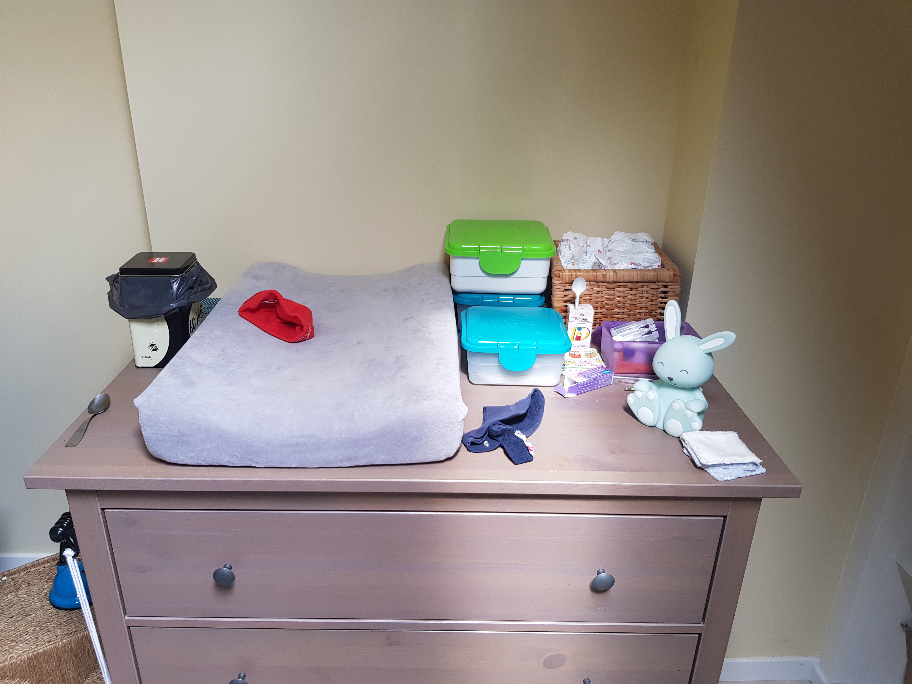
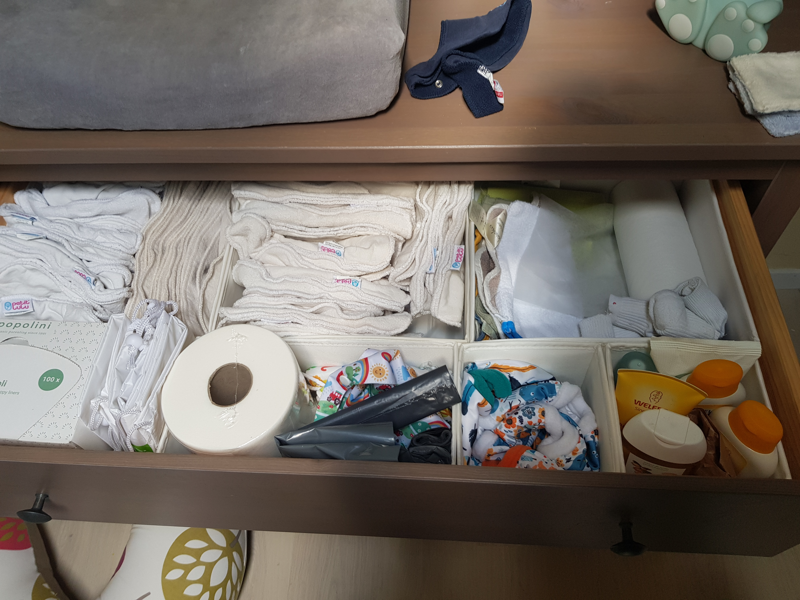
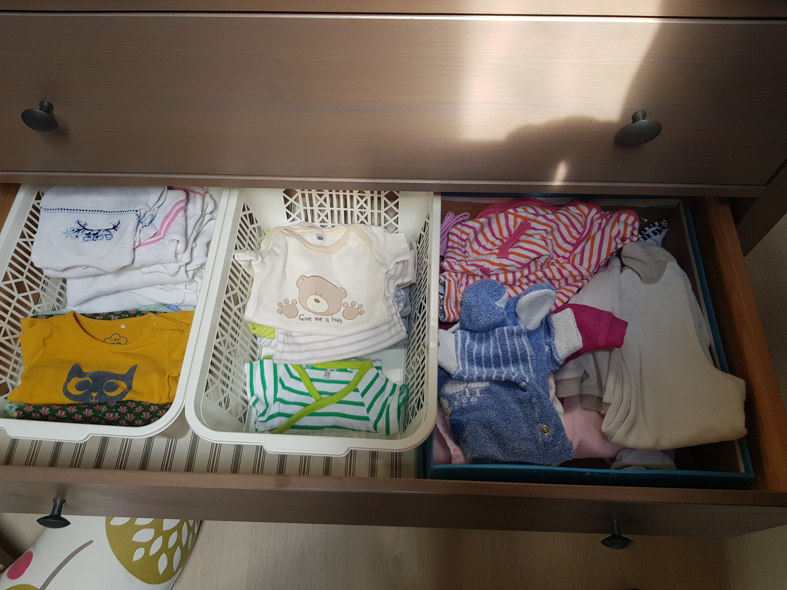
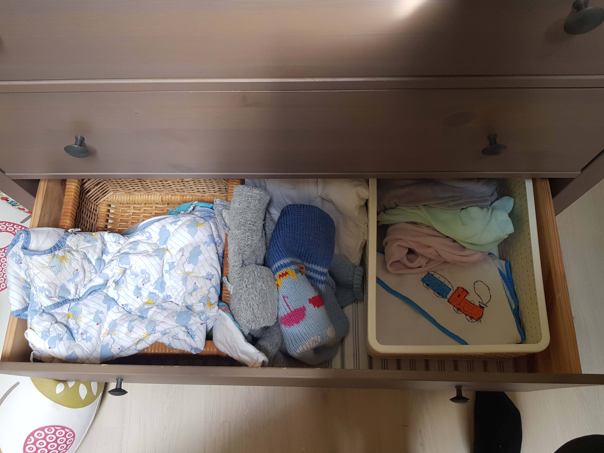

If the first weeks are any indication, you'll spend a _significant_ amount of time here. And since our setup is working pretty well, I'd decided to share it here. <!--more-->Since there are a lot of items that are just wasteful, we made sure that we didn't include total wastes of space like a nappy bin. Seriously, you don't need it..

What you will need is a setup to change the diaper of your baby. It's a place where you'll spend a lot of time, and while this area will evolve itself over time even if you start with the bare minimum, I really want to share how we did this.

## The setup

It's pretty straightforward: _baby goes on top_.  
The top part has the utilities that you can use for day-to-day toilet.  
From left to right:

- **The changing mat**: Put your baby here. If you have a boy: put something on the small sausage when you change him, so you don't get a complimentary shower. If you have a human: put a small absorbant pad under your babies bum. Not if, but when they pee you won't have to change the covers everytime.
- **Diaper disposal bin**: just make sure this is something you can close off. If you use reusable diapers (todo: link) you can put the small film in here that holds the poop. Do use normal throwaway diapers for the first days though, Meconium (spellcheck) is sticky stuff.
- **[Cheeky wipes](https://www.kudzu.be/nl/all-in-one-kit-cheeky-wipes-cheeky-wipes)**: these are reusable small wipes. There are two boxes. One has the clean wipes, another one stores the shitty ones.
- Diapers: we want to use renewable diapers later, but the first few weeks the ease of use of these throwaway-diapers is welcome. Also: the reusable ones are very bulky, especially for very small babies.
- **Vitamins/salves/thermometer/...**: We put a couple of frequently used meds and creams nearby. The most useful in my opinion is the barrier cream. Your baby will thank you. Your ears will too.
- **Complementary bunny**: I don't know why this is on the picture, but just tell yourself it's there to cheer you on.

Next up is the first drawer. In short: this drawer contains most stuff that is used with the washable diapers.

- **Inner padding**: for the reusable diapers. Make sure you lend a testkit to see if they are something for you.
- **Outer shell**: pick one with cute animals or figures. The eye also wants something.
- **Disposable diaper lining**:. I have no other words for these things. It's a very small but sturdy insert that will _attempt_ to capture most of the actual shitty stuff.
- **Disposable bags and washable bags**: one to throw the disposable small inserts, another one to put the inner padding for the diapers in so you can get them to the laundry. You'll also put the outer shell here not if, but when it gets soiled thoroughly.

This drawer is pretty straightforward. It contains the clothes and sleepsuits. This drawer grows with the baby, so until now we had pretty good luck with just changing it out.

More sleepsuits and socks. The last box are covers for the sleeping mat when the kid inevitably ruins it, and stuff like a hooded towel. Things you only need sometimes.

## Drawbacks

- The top drawer is prime pissing estate. This hasn't happened yet, but I can just see it happening. Use whatever means necessary to safeguard the diaper drawer.
